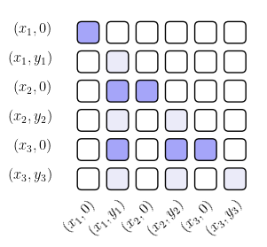

# Predictive Resampling of Linear Regression PFNs

> **Note: work in progress!**


## Research Overview


- We implement a [Prior-Data Fitted Network](https://arxiv.org/abs/2112.10510) for [in-context linear regression](https://arxiv.org/pdf/2306.15063). Due to our usecase, we deviate slightly from their architecture, and implement a different attention masking scheme to allow for autoregressive training and prediction. Model implementation can be found in `models/`.
- We replicate the results of Raventos et al. ([link](https://arxiv.org/pdf/2306.15063)), showing a task diversity threshold where the model transitions from memorising to generalising.
- We use [predictive resampling](https://royalsocietypublishing.org/doi/pdf/10.1098/rsta.2022.0142?download=true) to sample from the prior predictive distribution of the PFN. This gives a better view of the statistical model used by the PFN to perform in-context linear regression, rather than looking at a point prediction. (code adapted from Susan Wei's implementation)

### Results

We introduce an autoregressive attention masking scheme that allows the PFN to be trained and used for sequential prediction:

<p align="center">
  
</p>
<p><em>Autoregressive attention masking scheme for sequential prediction (darker shades are the positions we train on).</em></p>

We perform predictive resampling on the PFN to study the model's implied prior:

<p align="center">
  
</p>
<p align="center">
  
</p>
<p><em>Evolution of learned priors during training for a PFN trained on 1-context and 32768-context tasks. Each column shows a different training checkpoint, rows show different output dimensions. The plots compare the PFN's learned prior (blue) against the true N(0,1) prior (red) and actual task distribution (orange).</em></p>


## 📁 Project Structure

```
├── models/                     # Core model implementations
│   ├── autoregressive_pfn.py          # Main PFN transformer
│   ├── autoregressive_pfn_attention.py # Custom attention masking
│   └── config.py                       # Model and training configurations
├── samplers/                   # Task generation and data sampling
│   ├── tasks.py  # Task distributions
├── experiments/                # Research experiments and analysis
│   ├── exp_*.py                # Various experiments
│   └── experiment_configs.py          # Experiment registry
├── predictive_resampling/      # Predictive resampling tools
├── checkpoints/               # Saved models and task distributions
└── plots/                    # Generated figures and results
```

##  Setup and Usage

### Environment Setup

This project uses [uv](https://docs.astral.sh/uv/) for dependency management:

```bash
# Install uv if you haven't already
pip install uv

# Clone the repository
git clone <repository-url>
cd linear-regression-pfn

# Create environment and install dependencies
uv sync

# Verify installation
uv run python -m pip list
```

### Training Models

#### Single Model Training
```bash
# (edit models/config.py first)
uv run python train.py
```

#### Parallel Task Diversity Sweep
```bash
# Run sweep across multiple task sizes
uv run python train_parallel.py

# Custom sweep parameters
uv run python train_parallel.py --tasks 4 16 64 256 --steps 50000 --batch 256
```

### Running Experiments

Experiments are designed to run as notebook-style scripts using `#%%` separators in VSCode, but can also be run as a script:

```bash
# Task diversity performance plots
uv run python experiments/exp_raventos_plots.py

# Predictive resampling analysis
uv run python experiments/exp_predictive_resampling_prior.py

# Losses across checkpoints
uv run python experiments/exp_loss_across_checkpoints.py


```

**Note**: Update `experiments/experiment_configs.py` with your specific run IDs and checkpoint indices before running experiments (todo: make this more automatic). 

## Model Configuration

Key model parameters (defined in `models/config.py`):

```python
ModelConfig(
    d_model=128,      # Transformer dimension
    d_x=16,           # Input dimension
    d_y=1,            # Output dimension (scalar regression)
    d_vocab=128,      # Vocabulary size for y-value binning
    n_ctx=128,        # Context length
    n_layers=2,       # Transformer layers
    n_heads=2,        # Attention heads
    y_min=-7, y_max=7 # Y-value range for binning
)
```

## Todos / Future Work

- [ ] Better bucketing of y-values. Unfortunately my previous training run had buckets that were too narrow.
- [ ] Consider setups other than linear regression.
- [ ] Cleaning up code and removing redundant functions.
- [ ] Logic to remove hardcoding.
